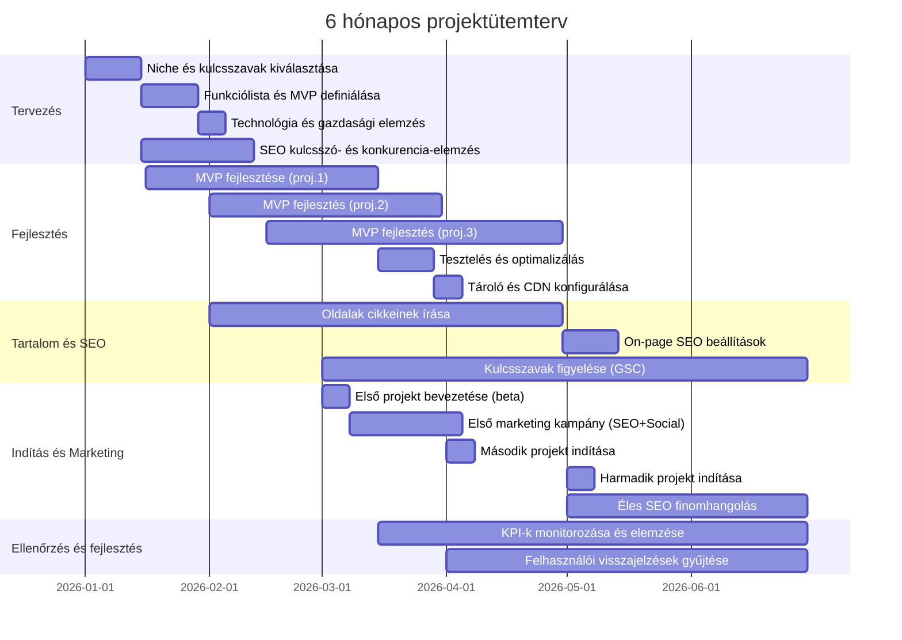

# Jogi és hirdetési szabályok

A nagy hirdetési hálózatok (Google AdSense, AdMob stb.) szigorú szabályokat írnak elő. **Tilos** például nyilvánosan kattintásra ösztönző feliratokat vagy nyilakat elhelyezni a hirdetések körül, illetve hamis címkékkel (pl. “Hasznos linkek” alatt) álcázni azokat. A hirdetéseket egyértelműen „Hirdetés” vagy „Szponzorált” címkével kell ellátni, különben szabálysértésnek minősül. Továbbá **tiltott** az a gyakorlat, amikor egy weboldalt vagy alkalmazást kizárólag a hirdetések megjelenítésére hoznak létre – azaz tartalom helyett hirdetések dominálnak az oldalon. Ez könnyen az AdSense-fiók letiltásához vezethet. Ugyancsak tiltja a Google az agresszív felugró hirdetéseket: ha a reklám automatikusan megjelenik és eltávolításához csak kattintás vagy zárógomb vezet, az gyakran szabályellenesnek számít. Összefoglalva: **ne csalogassuk félrevezetően a felhasználót hirdetésre kattintásra**, ne rejt­sük el a hirdetést a normál tartalom közé, és ne tegyük lehetetlenné a felhasználói élményt.

Európai szabályozás is van: mivel az oldal magyar és EU-s joghatóság alá esik, GDPR/ e-Privacy előírásokat is be kell tartani. Például cookie-engedélyt kell kérni, ha személyes adatokkal rendelkező sütiket (pl. hirdetéskövetés) szeretnénk alkalmazni. A felhasználóknak világos tájékoztatást kell adni arról, hogy a honlap milyen módon gyűjt és használ személyes adatokat (például a hirdetések személyre szabásához). 

# Magas bevételű témák és célközönség

A hirdetési bevételek erősen függenek a témától és a célközönségtől. Elemzések szerint a **pénzügyi, biztosítási, jogi és üzleti** témákban a legmagasabb a CPC (kattintásonkénti ár). Például „insurance” vagy „car insurance” kulcsszavakra 50–100 dolláros CPC is előfordul. A Publift elemzése szerint az első helyen áll az **Insurance**, továbbá nagyon fizetősek a **crypto**, **health/fitness**, **real estate**, **digital marketing**, **personal finance**, **legal services** és **travel** kulcsszavak is. Ezeket a területeket jellemzi, hogy a hirdetők nagy összegeket költenek, így a kiemelkedően fizetős hirdetések jelenhetnek meg rajtuk. 

Ezzel szemben a **szórakoztató, játékos vagy fiataloknak szóló tartalmaknál** általában alacsonyabb az egységnyi kattintás értéke. Például mémoldalak vagy általános játékos tartalom több látogatót hozhat, de a hirdetők kevesebbet fizetnek egy-egy kattintásért ezekre. Érdemes tehát olyan témákat választani, amikre magas CPC-vel rendelkező hirdetések vannak – ugyanakkor ezek általában versengőbb kulcsszavak. 

A célközönség szempontjából: **leginkább olyan felhasználókra koncentráljunk, akik vásárlóerejűek vagy aktívan keresik a megoldást.** Pénzügy, biztosítás, utazás vagy egészség témákban gyakran középkorú, keresőképes rétegek mozognak (akik tényleg költenek pénzt), ezért magasabb bevételt eredményezhetnek. Ha viszont fiatalabb, szórakozásra vágyó közönséget célzunk (pl. mémek, ingyenes játékok), nagyobb forgalmat érhetünk el, de alacsonyabb bevételt egy kattintásból.

# SEO és növekedési csatornák

A reklámbevételek kulcsa a nagyszámú és jó minőségű organikus látogató. Az SEO (keresőoptimalizálás) az elsődleges eszköz: **keressünk olyan kulcsszavakat, amelyekre sokan keresnek**, és készítsünk ezekre tartalmat. Például a *“calorie calculator”* és hasonló keresésekre naponta több tízezer keresés jöhet (a kulcsszó-tervező szerint például az „insurance” körülbelül 1 millió havi keresést kap az USA-ban). A nagy forgalom több hirdetéskattintást jelenthet: minél több oldalmegtekintést érsz el, annál nagyobb az esélye bevételre. Érdemes kulcsszótervezővel és Google Analytics/Console használatával ellenőrizni, hogy mely kifejezésekre van sok találat, és ott jól rangsorolni.

Mivel a látogatók túlnyomó része ma mobilról jön, a weboldal legyen **mobilbarát és gyors**. A Google szerint több mint a felhasználók fele (53%) elhagyja azt az oldalt, amely mobilon több mint 3 másodperc alatt tölt be. Így fontosak a gyors betöltési idők és a reszponzív (mobilra optimalizált) dizájn, valamint a Lighthouse/Pagespeed audit használata a problémák felderítésére. A jobb UX nemcsak a felhasználókat tartja meg, de a Google rangsorolásnak és az AdSense-megtarthatóságnak is kedvez.

A forgalom generálásához nemcsak SEO-ra támaszkodhatunk. **Közösségi csatornák** is fontosak lehetnek: például TikTokon vagy YouTube Shorts videóban bemutathatunk egy hasznos eszközt („Ez az ingyenes AI-tool készíti meg neked…”) és a profil linkjét behelyezve hívhatjuk a nézőket a weboldalra. Redditen, Facebookon vagy Quorán szintén elhelyezhetünk a releváns aloldalakra mutató linkeket (ha valóban hasznos tartalom a háttérben), vagy partnerségbe léphetünk témába vágó influencerekkel. A közösségi megosztás felpörgetheti az organikus forgalmat, de mindig tartsuk szem előtt, hogy a tartalomnak **valóban értéket kell nyújtania**, különben visszaforduló hatása lesz.

# Gyorsan fejleszthető projektek ötletei

- **AI-eszközök és kalkulátorok:** Egy-egy egyszerű online eszköz (például AI alapú képgenerátor, profilkép-javító, önéletrajz-készítő, szövegfordító, matekmegoldó vagy épp kalóriaszámláló) rengeteg keresést kap. Ezek előnye, hogy egyszer elkészítve újrafelhasználhatóak: sok látogató tér vissza hozzájuk ismétlődően. Magas a keresési volumene, ráadásul a programozásuk egyszerű (pl. ingyenes vagy olcsó AI-API-ként használhatók). Ha egy ilyen eszköz jól működik, hosszú távú, stabil látogatottságot érhetünk el vele (és általában ezekben a témákban is kedvezőek a hirdetési díjak). 

- **Letöltők és konverterek:** Rövid, egyfunkciós oldalak, amelyek például YouTube-videókból lementik a képet vagy videót, Instagram profilképet töltenek le, PDF-et alakítanak Wordbe, vagy QR-kódot generálnak. Ezek a szolgáltatások nagyon keresettek, ráadásul SEO-val (Google-keresővel) könnyen hozhatnak látogatót (pl. „YouTube thumbnail downloader” vagy „QR generator” keresőszavakra napi sok ezer keresés lehet). A felhasználók általában ingyenesen használják őket, de közben banner-, interstitial- vagy affiliate hirdetéseket lehet megjeleníteni.

-  **Játékok (mobilra/webre):** Az appok közül a játékok különösen jövedelmezőek lehetnek. Készíthetünk egyszerű, önálló játékokat (idle clicker, sodoku, szórejtvény, memóriajáték stb.), amelyek sokáig lekötik a felhasználót. Ezekben a legtöbb reklámtípus használható: például banner és interstitial hirdetések a játék közben, de leginkább a **jutalmazó videók** hatékonyak (a játékos önként megnéz egy rövid reklámot, cserébe jutalmat kap a játékban). Az AdMob (Google mobilhirdetés) kifejezetten engedélyezi a jutalmazott videós hirdetéseket, mert azok jobb élményt biztosítanak és magasabb bevételt hoznak, mint a zaklató pop-upok. Fontos, hogy a reklámok ne zavarják túlzottan a játék menetét: ha a felhasználó sok időt tölt az alkalmazásban, több alkalommal (ám önként) is visszanézhet újabb reklámokat.

-  **Wallpaper-alkalmazások és mémoldalak:** Egy másik ötlet a háttérképeket kínáló mobilapp vagy weboldal. Naponta frissülő, vonzó háttérképek – legyen az természetfotó, városkép, illusztráció – miatt a felhasználók rendszeresen visszatérnek (jó napi, heti látogatottságot lehet elérni). Egy ilyen appban vagy weboldalon rengeteg hirdetési hely van bannerként, interstitialként stb., és a felhasználók szívesen lapozgatják. Hasonlóképpen **mémoldal** is nagy látogatottságot vonzhat, ha automatikusan szedi össze a népszerű mémeket Reddit vagy Twitter-áramlatokból. Bár a mémes közönség fiatalabb és alacsonyabb CPC-t jelent, hatalmas forgalommal még így is jelentős összbevétel érhető el. A siker kulcsa itt is a gyakori frissítés és a közösségi megosztás ösztönzése.

-  **Receptek és egészség:** Az ételek és egészségtémák is keresett területek. Egy receptekre specializált oldal minden új receptjével egy külön aloldalt kap (például egy “Földimogyoró-szójamártásos grillezett csirke” recept) – ezekre erős SEO-forgalmat építhetünk. Példa: a New York Times is népszerűsíti rendszeresen a receptjeit közösségi oldalain (a fenti kép is egy recepteket tartalmazó poszt része). Emellett általános egészség- és fitnessz kalkulátorok (kalória-, makrószámoló, testtömegindex-kalkulátor, fogyókúraterv-generátor) vagy fogyási tippek szintén sok látogatót vonzanak. Ezekben a témákban nemcsak az emberek aktívan keresnek információt, hanem a hirdetők is gyakran magasabb összeget fizetnek például étkezési tanácsokért vagy edzésprogramokért. 

Összefoglalva: fejlesztőként érdemes több kisebb, SEO-orientált projektet indítani (például sokféle kalkulátor, AI-tool vagy letöltő oldal). Ezeket ugyanazzal a backenddel, dizájnnal és hirdetési felülettel üzemeltethetjük. Minél több ilyen oldal vagy app fut, annál nagyobb lesz az összesített organikus forgalom és bevétel, miközben egy-egy fejlesztés viszonylag kevés időt igényel.

**Források:** Google AdSense hirdetéselhelyezési és felhasználói élmény irányelvek. Az itt idézett források a legfrissebb Google és iparági statisztikákat és szakmai elemzéseket tartalmazzák.

# Vezetői összefoglaló  
A sikeres, hirdetésekkel monetizált webes projekt kulcsa a nagy forgalom és a jó felhasználói élmény ötvözése. Elemzésünk szerint a legjövedelmezőbb témák között szerepel a technológiai/AI, a pénzügy és az egészség–fitness, ahol az átlagos CPM 5–15€ körül alakulhat. Ezekben a témákban egy-egy 100 000 oldalletöltés már több száz eurónyi havi bevételt hozhat. A terveink több egyszerű webalkalmazást foglalnak magukban (pl. AI-eszközök, kalkulátorok, játékok, receptek), minden esetben SEO- és teljesítmény-optimalizáltan. Az EU-központú gyorsítótár (pl. Cloudflare CDN) és a regionális szerverválasztás révén a TTFB <200 ms lehet (Google ajánlása alapján). Monetizációra elsődlegesen a Google AdSense és AdMob szolgál, kiegészítve közepes forgalomnál alternatív hálózatokkal (pl. Mediavine, Raptive). Ütemtervünk a niche-kiválasztásból és kulcsszókutatásból indul, majd MVP-fejlesztést és SEO-tartalom írást követ, a 3 legfontosabb projekt bevezetése 3–5 hónapon belül történik. Fontos mérőszámok a DAU/MAU, oldalletöltések, visszafordulási arány és az AdSense-mutatók (CTR, eCPM, RPM) . Alábbi részletes tervünk bemutatja a legígéretesebb kategóriákat, a top 3 projekt tervezett felépítését, technológiai és SEO-stratégiáját, valamint költség- és bevételbecsléseit.

## Jövedelmező témák és célközönségek  
- **Magas értékű témák (üzleti/tech/egészség)** – Google AdSense statisztikák alapján pénzügyben, biztosításban, egészségben szoktak a legmagasabb (több dolláros) CPC-k előfordulni. Egy általános tartalomoldalon a CPM 0,30–2€ között mozoghat, míg magas értékű niche-ekben elérheti az 5–15€-t. Ezekben a témákban a hirdetők többet fizetnek, azaz az egy felhasználóra jutó bevétel (RPM) magasabb.  
- **AI-eszközök (tech-savvy közönség)** – elsősorban a 18–40 éves, technológiára fogékony felhasználókat célozzuk, akik kreatív vagy rutin feladatok automatizálását keresik. Mivel az AI-eszközök rohamléptekkel terjednek, minden új generatív megoldás nagy keresletre számíthat. Ezeknél a site-oknál a látogatók visszatérnek például napi képgenerálásra vagy szövegírásra. Hirdetési szempontból a tech témák szintén magas CPM-esek.  
- **Kalkulátorok** – széles, minden korosztályt érintő célcsoport, diákoktól kezdve dolgozó felnőttekig. Ide tartoznak a pénzügyi (hitel-, bér-, valuta-kalkulátorok) és életmóddal kapcsolatos számológépek (BMI, kalória, adók). A felhasználói igény itt megoldáskereső: gyors válaszokat várnak (pl. „hány kalória?”, „mennyi hitelre számíthatok?”). Retenció alacsonyabb, hiszen a felhasználók konkrét kérdéssel jönnek, de az organikus keresésből és oldallekérésből sok forgalom érkezik. A magas kereslet miatt ezek is jó hirdetési bevételt hozhatnak, különösen a pénzügyi kalkulátorok (CDP/CPC akár több € is).  
- **Játékok (böngészős vagy mobil)** – világszerte ~3,32 milliárd aktív játékos van (2026-ban), főként 16–44 év közötti férfiak. A célközönség szórakozásra vágyik, és ha egy játék szórakoztató, szívesen töltenek vele hosszabb időt. Ilyen site-okon / appokban többféle hirdetés (banner, interstitial, jutalomvideó) is elhelyezhető. A felhasználók gyakran napi szinten játszanak (magas DAU), a retenció erős lehet. Ugyanakkor a játékos tartalmak általában közepes hirdetési értékűek (CTR/CDP alacsonyabb), bár a hosszú játékidő sok bannermegjelenést eredményez.  
- **Háttérképek (Wallpaper app)** – leginkább mobilfelhasználók, főként fiatalok és tech-rajongók. Fő felhasználói igényük naponta új, látványos háttérkép. A felhasználók visszatérőek lehetnek (pl. napi új háttér megtekintés). A reklámbevételek közepesek, jellemzően in-app banner és interstitial formátumban (AdMob). A képek mérete miatt sok CDN-ből szolgáljuk ki (pl. Cloudflare), hogy a letöltési idő alacsony legyen.  
- **Meméző oldalak** – fiatal, közösségi média orientált közönség. Cél: gyors szórakoztatás, megosztás. A tartalom többsége felhasználók vagy közösségi források által generált. Monetizáció alacsonyabb (szórakoztató témák alacsony CPC-vel), ám jó csatornát jelenthet a virális terjedésre (Facebook, Reddit megosztások). Tartalomgyártása viszont nagyobb erőforrást igényel (képek, videók szerkesztése).  
- **Receptek és gasztronómia** – elsősorban főzés iránt érdeklődő, főleg 25–55 éves nők. Statisztika szerint a felnőttek ~90%-a keres rá receptekre online, és 91%-uk megbízik az online receptoldalakban. Mivel a kulcsszókutatás itt kifejezetten erős, egy jól felépített receptoldal (vagy annak egy része) rengeteg organikus látogatót hozhat. A receptoldalak (kép- és szövegtartalommal) lassabban növelhetők, de folyamatosan karbantartott blog bejegyzésekkel és receptgyűjteménnyel hosszú távon rendszeres forgalmat adnak. Az élelmiszeripari hirdetők árai középmagasak (CDP ~0,15–0,50$ körül).  

## Projektötletek összehasonlítása

- **AI-eszközök** – *Célközönség:* fiatal, tech-savvy felhasználók. *Felhasználói igény:* kreatív eszközök (képgenerálás, szövegírás, fordítás, stb.). *Hirdetési érték:* nagy (tech/AITop témák 5–15€ CPM). *Előnyök:* erős SEO-kereslet az új AI szolgáltatások iránt, sok visszatérés egy jó eszközhöz. *Hátrányok:* erős verseny az ingyenes eszközök piacán; API-költségek (pl. DALL·E, GPT) ha valós időben generálunk. *Retention:* magas, ha valóban hasznos eszközt kínálunk. *Viralitás:* jó, ha megosztható példákat (pl. „AI generálta profilkép”) mutatunk.  
- **Kalkulátor oldalak (pénzügyi, életmód)** – *Célközönség:* széles (diákok, anyák, dolgozók). *Felhasználói igény:* konkrét problémák megoldása (BMI-kalkulátor, hitelkalkulátor, stb.). *Hirdetési érték:* vegyes. Az általános kalkulátoroknál alacsonyabb, de a pénzügyiek (hitel, biztosítás) kiemelten magas CPC-ket hoznak. *Előnyök:* SEO-val jól tervezhető, sok keresési volumen (pl. “hitelkalkulátor” tízezres havi keresések). *Hátrányok:* a felhasználók egyszeri használók, viszonylag alacsony oldalon eltöltött idő; kevés mobilfelhasználói visszatérés. *Retention:* alacsony. *Viralitás:* kicsi, főleg SEO alapú forgalomra épül.  
- **Letöltő oldalak (videó, kép)** – *Célközönség:* fiatalabb internethasználók (TikTok/YouTube/X generáció). *Felhasználói igény:* konkrét tartalmak letöltése (YouTube videó, Insta profilkép). *Hirdetési érték:* alacsony-közepes (szórakoztató témákban alacsony CPC). *Előnyök:* egyszerű eszköz fejleszteni, gyors SEO-rangsorolás “letöltő oldalak” kulcsszavaknál. *Hátrányok:* jogi rizikó (pl. szerzői jog, YouTube DMCA); a felhasználók csak célirányosan érkeznek. *Retention:* alacsony. *Viralitás:* közepes, ha valami ritka eszközt kínál.  
- **Böngészős játékok** – *Célközönség:* széles, elsősorban fiatal férfiak. *Felhasználói igény:* szórakozás, versengés. *Hirdetési érték:* mérsékelt (játékos témák alacsonyabb CPC). *Előnyök:* magas felhasználói elköteleződés (folyamatos hirdetésnézet játék közben). *Hátrányok:* fejlesztés összetettebb, erős konkurencia a népszerű játékok piacán. *Retention:* magas, ha szórakoztató és jutalmaz. *Viralitás:* potenciálisan erős (főként ha van közösségi elem vagy verseny).  
- **Wallpaper alkalmazás/weboldal** – *Célközönség:* mobilos felhasználók, telefon-témázók. *Felhasználói igény:* napi friss hátterek. *Hirdetési érték:* átlagos (in-app hirdetések). *Előnyök:* magas napi visszatérés (naponta új háttér). *Hátrányok:* nagy képméretű fájlok (CDN igény), app engedélyezés (AdMob szabályok). *Retention:* magas (az emberek gyakran lecserélnek naponta). *Viralitás:* közepes, ha látványos, jól tematizált képeket kínál.  
- **Meme oldal** – *Célközönség:* tinédzserek, fiatal felnőttek. *Felhasználói igény:* gyors szórakoztatás, humor. *Hirdetési érték:* alacsony (vírusként terjedő szórakoztató tartalom). *Előnyök:* könnyen termelhető tartalom közösségi forrásokból (pl. Reddit integráció). *Hátrányok:* alacsony bevétel/felhasználó, nagy mennyiségű moderáció. *Retention:* alacsony–közepes (napi friss mémek). *Viralitás:* nagyon magas, ha jól időzített és kreatív a tartalom.  
- **Receptek és gasztronómia** – *Célközönség:* főzéskedvelők, főleg 25–55 közötti felnőttek. *Felhasználói igény:* receptek keresése, ételötletek. *Hirdetési érték:* közepes (élelmiszer, bevásárlás kategoriák). *Előnyök:* rendkívül magas keresési volumen (90% online keres receptet), bizalmat élveznek (91% megbízik az online receptoldalakban). *Hátrányok:* sok tartalomra van szükség (szöveg+képek), hosszabb termékfejlesztés. *Retention:* mérsékelt (rendszeresen főző felhasználók visszatérhetnek). *Viralitás:* közepes (népszerű receptek megoszthatók social médiában).  

## Top 5 javasolt projekt (rangsorolás és indoklás)  
1. **AI-eszközök portálja** – Legmagasabb prioritás, mert a téma trendi és magas hirdetési árral bír (tech/AI), könnyen pozícionálható SEO-val. Emellett többet is el lehet adni egy fejlesztőnek (ráépíthető új funkciókra).  
2. **Pénzügyi kalkulátorok oldalai** – A pénzügyi niche-ben kiugróan magas CPC-kért fizetnek a hirdetők. Egy jól célzott hitel-/adó-/valuta-kalkulátor portál gyors organikus forgalomra tehet szert, és az egy látogatóra jutó bevétel is magas.  
3. **Egészség/fitness eszközök** – Kalória-, BMI-, makrókalkulátorok és diétás tartalom iránt folyamatos a kereslet. Az egészség/fitness is magas kategória hirdetői fizetési hajlandóság szempontjából. Ráadásul a felhasználók hosszú távon visszatérhetnek (életmódváltás esetén).  
4. **Online játék (idle clicker)** – Nagy piaci méret (3,3 milliárd játékos) miatt rengeteg felhasználót érhetünk el. Főleg mobilon jó bevételi lehetőség a rewarded video formátum miatt (játékosok önként néznek videót jutalomért).  
5. **Recept- és gasztrooldal** – Kiemelkedő SEO-lehetőség, hiszen rengeteg hosszú farukon+keresés rá (pl. havi tízezres kulcsszavak). Több recept és cikk hosszú távú, stabil forgalmat biztosít. A hirdetések értéke közepes, de a nagyszámú látogatóból összességében szép bevétel jöhet.  

## 1. **AI-eszközök** – részletes terv  
- **MVP funkciók:** Készítsünk egy központi weboldalt (pl. _ai-eszkozok.hu_), ahol 3–5 ingyenes AI-eszköz érhető el külön menüpontokban. Például: AI kép háttérgenerátor, profilkép javító, önéletrajz- vagy levélíró bot, gyors fordító, matekfeladat-megoldó. (A felhasználó beírja a kért szöveget vagy feltölt egy képet, a háttérben AI API-k (pl. OpenAI, Replicate stb.) dolgoznak.) Minimalizáljuk a regisztrációs igényt, egyszerű, modern felületet építünk (Next.js, SvelteKit).  
- **Technológiai stack:** Érdemes statikus/SSG alapra (pl. Next.js SSG vagy Gatsby/Hugo) építeni a landing oldalakat és eszközöket, hogy a tartalom keresőbarát legyen. Az AI-funkciókhoz Node.js (Express) backend vagy serverless függvények (Vercel, Netlify Functions) hívhatók meg. Alternatívaként egy egyszerű Python (Flask/FastAPI) szolgál backendként. Mivel sok kép készül, használjunk CDN-t (Cloudflare, Fastly) és cache-lést. A site-ot EU-szolgáltatóhoz (pl. AWS eu-central (Frankfurt) vagy DigitalOcean Frankfurt) telepítjük a <200ms TTFB érdekében.  
- **Domain, hosting, CDN:** .hu vagy .eu végződés növelheti az európai SEO-t, de .com is használható nemzetközi eléréshez. SSL-t Ingyenes Let's Encrypt-szel intézünk. Alap hostingnak megfelel egy kis virtuális szerver (pl. 1 vCPU, 2GB RAM – DigitalOcean: ~5€/hó) vagy Netlify/Vercel ingyenes csomag (heti 300 build perc, 100 GB sávszélesség). A dinamikus API-hívásokra, ha szükséges, FaaS is elég. Statikus tartalomra CDN-t (Cloudflare – Európában 57 adatközponttal) ajánlott alkalmazni.  
- **Cache és teljesítmény:** Statikus oldal és CDN révén a leggyakoribb oldalaknál akár <50 ms TTFB-t érhetünk el cache-elve. Az AI-eszközök válaszidejét háttérben optimalizáljuk (pl. rövid TTL-edzések, eredmények cache-elése). HTTP/2 és kompresszió (gzip, brotli) beállítása a jobb teljesítményért. Minden oldalra biztosítsunk gyors HTTP cache-fejléceket. Elő-töltő (prefetch) technikák és lazy-loading képek alkalmazása is ajánlott.  
- **Tárhely és sávszélesség:** Tegyük fel, hogy egy képátméretező/generátor napi 10 000 felhasználót szolgál ki, átlag 0,5 MB adatot. 30 napra ez ~150 GB forgalom. Egy egyszerű DO droplethez 500 GB havi ingyenes kimenő adat tartozik, az elegendő ennek a forgalomnak. Nagyobb (1M PV) forgalomnál érdemes 2-4 vCPU-s VPS-t választani (~10–20€/hó), esetleg felhős storage-t (pl. S3-szerű) a képeknek, ahol a CDN-ből kiszolgált mennyiséget csak minimálisan fizetjük extra (1M PV esetén plusz néhány tíz euró).  
- **Költségbecslés:** Domain: ~10 €/év. SSL: 0 €. Hosting: kis VPS ~5 €/hó (60 €/év). CDN és analitika ingyen (Cloudflare, Google Analytics). Összesen ~70 €/év indulásként. Nagyobb forgalomnál a VPS költsége nő (100k PV-nál 5–10 €/hó, 1M PV-nál 10–20 €/hó), további 50–150 €/hó sávszélesség-terhelés esetén is. (Erről lásd táblázat **Költségek**.)  
- **Tartalom- és SEO-stratégia:** Kulcsszó-kutatás eszközök (Google Keyword Planner, SEMrush) segít meghatározni az emberek által keresett AI-funkciókat (pl. „AI képgenerátor ingyen”). Minden eszköz külön aloldalt kap: világos URL-ekkel (/ai-kepgenerator, /ai-reszume). Oldalszerkezet: H1 címsor a kulcsszóval (pl. „AI Háttérképgenerátor ingyen”), rövid ismertető, majd felület. Schema.org struktúra (például FAQ vagy HowTo schema) használata növelheti az átkattintási arányt a találati listában. Belső linkek: az AI-eszközök egymásra mutathatnak, és linkelhetjük őket blog cikkekhez (pl. „Hogyan segít az AI önéletrajzírásban”). 10 oldal tartalomterv: pl. 5 eszközoldal (háttérgenerátor, profilkép, önéletrajz, email-asszisztens, fordító, stb.) és 5 blogcikk (AI trendek, eszközök használata, esettanulmányok). Mindegyik oldalon releváns kulcsszavakat és metaadatokat (title, meta description) használunk.  
- **Felhasználószerzés:** SEO (Google) a fő csatorna – pl. „ingyenes AI generátor” keresésekre. Ezen kívül rövid videók TikTokon/YouTube Shortson (mutassuk be az eszközt használat közben) szerezhetnek gyors látogatottságot; TikToknak globális 2,2 milliárd MAU-ja van, főleg a fiatal 18–24 korosztályban. Redditen (r/FreeCodingTools, r/Entrepreneur) és magyar fórumokon (Pl. Hacker fórum, Facebook csoportok) bemutatva szintén forgalmat hozhatunk. Fizetett hirdetés (Google Ads, Facebook Ads) kezdetben kiegészítő lehetőség a legjobban teljesítő kulcsszavak tesztelésére, de főként organikus növekedésre építünk. Várható konverzió: SEO-s weboldal esetén az első hely 20-30% CTR-t hozhat, TikTok/videók ezer megtekintésre 1-2% linkátkattintást, Redditen 1-5% lehet (erősen témafüggő).  
- **Hirdetési hálózat és elhelyezés:** Kódoláskor beállítjuk a Google AdSense-t (web) és AdMob-ot (ha app is készül). Fontos betartani a szabályokat: **Rejtett/megvezető hirdetés nincs:** a reklámok ne keveredjenek a tartalommal. Ne erőltessük az „ejtőernyős” hirdetéseket; a blog ajánlja min. 150 px távolságot a fő tartalomtól. A hirdetések között igyekezzünk szellősen elrendezni, nehogy véletlen klikk miatt felfüggesszék fiókunkat. A fő fókusz a felhasználói élmény: ha túl agresszíven pakolunk ki adokat (pl. kattintásra blokkoló reklám), rövid távú bevételnövekedés után sokan elhagyják az oldalt és veszélybe kerül az AdSense-számla. (Később, ha elérjük az igényeket, csatlakozhatunk Mediavine-hoz vagy Raptive-hez is magasabb RPM-ekért.)  
- **Mérőszámok (KPI):** Figyeljük a napi/havi aktív felhasználókat (DAU/MAU), oldalletöltés számot (PV), a visszafordulási arányt és az átlagos munkamenet hosszát. Hirdetésoldalon kövessük a CTR-t, CPC-t és RPM-et. (Pl. a CPC a tartalomtól függően átlag 0,05–0,50$, de pénzügyi kulcsszavaknál 2$ fölé is mehet.) A vezérlőpulton folyamatosan nézzük a bevétel és forgalom alakulását. Hosszú távon mérjük az egy látogatóra jutó élettartamértéket (LTV), ha például hírlevélre vagy regisztrációra tudjuk ösztönözni a visszatérőket. (Az AdSense hivatalos dokumentációja szerint az RPM a legfontosabb mutató, hiszen 1000 megjelenítésre vetíti a bevételt.)  

## 2. **Pénzügyi kalkulátorok** – részletes terv  
- **MVP funkciók:** Több pénzügyi számológép, például lakáshitel-kalkulátor, személyi hitel, valutakonverter, fizetés/költség kalkulátor. Ezen kívül tanácsadó tartalom (blogcikkek: „Hogyan vegyél fel hitelt”, „Spórolási tippek”). A weboldal (pl. _kalkulatorok.hu_) statikus vagy egyszerű CMS alapú. Minden kalkulátor külön oldalként is SEO-célpont (pl. /hitelkalkulator, /berkalkulator). Működés: JavaScript alapú, azonnali számítás kliens oldalon, adatbázis nem szükséges.  
- **Tech stack:** Megfelel egy statikus generátor (pl. Hugo) vagy React-alapú site (Next.js, Gatsby) szerveroldali előtöltéssel (SSG). A backend minimális: opcionálisan PHP/NodeJS a bonyolultabb számításokhoz. Hosting: lehet akár ingyenes (Netlify/Vercel) vagy egy kis VPS (~5€/hó). CDN kötelező (tartalom gyorsítótárazása). Mivel elsősorban SEO-támogatott tartalom lesz, a statikus HTML a legjobb. A site-ot leginkább EU szerverre (pl. DigitalOcean Frankfurt) telepítjük a gyors betöltésért.  
- **Domain, hosting, CDN:** Lehet pl. egy pénzügyi kulcsszót tartalmazó domain (pl. *hitelkalkulator.eu*), vagy brand-elt (hiteltan.blogspot.hu). .eu a legális EU jelenlét miatt előnyös lehet. SSL: ingyenes Let’s Encrypt. Tárhely: statikus esetén elég a Netlify Free (100 GB/bandwidth), nagyobb forgalomnál 5€/hó VPS. CDN: Cloudflare, mivel az oldal lokálisan (EU) elérhetőbb.  
- **Cache és teljesítmény:** Oldalak többsége előre generált HTML, így rengeteg cache-elhető. Beállítunk teljes oldal- és fájlküldés cache-t (worker vagy plugin segítségével). A cél <100 ms TTFB EU-ból. (InMotion Hosting iránymutatása szerint 200 ms alatti TTFB a cél; statikus oldallal ez könnyen elérhető.)  
- **Tartalom- és SEO-terv:** Minden kalkulátorhoz hasznos, kulcsszóra optimalizált leírás készül. URL-ek: pl. `/kalkulator/hitel`, `/kalkulator/ber`. Cikkek: kulcsszó-elemzés alapján összeállított 10 oldalas terv: hitelkalkulátor, adókalkulátor, bérkalkulátor, valuta váltó, befektetésnaptár, pénzügyi tippek blog, hitelelvétel lépései, spórolási táblázat, diákpénz kalkulátor, lakásvásárlási útmutató. Minden oldalon törekszünk minőségi tartalomra (pl. táblázatokat, interaktív elemeket beillesztve) és strukturált adatokra (Schema: FAQ, CurrencyConverter, HowTo). Belső linkek: pl. a hitelkalkulátorból a cikkekre, blogcikkekből a kalkulátorokra mutató linkek. A domain életkorának növelése és szabályos linképítés révén (vendégposztok, közösségi megosztások) építünk hitelességet.  
- **Felhasználószerzés:** SEO elsődleges: komoly kulcsszókutatással (pl. Google Trends, Keyword Planner). Google Ads kampány próbálható tesztelésre („hitel kalkulátor”), de a költségkeret limitált legyen. Facebook/LinkedIn hirdetések is használhatók pénzügyi csoportokban. Reddit: magyar és angol pénzügyi fórumokban (r/hu_penz, r/PersonalFinance). YouTube Shorts: rövid videók a kalkulátorok használatáról. Konverziós ráta: organikus Google-on a top-1 pozíció ~25-30% CTR, a célzott hirdetés ~2-5% lehet, SEO után visszatérő feliratkozás ~5%.  
- **Hirdetési hálózat:** Alap AdSense bannerrel és szövegbeágyazott hirdetésekkel dolgozunk (pénzügyi kulcsszavak CPC-je $2+). A tartalom elsőbbségét szem előtt tartjuk (min. kétszer több tartalom mint hirdetés), hogy megfeleljünk AdSense szabályoknak. A hirdetések legyenek jól elhatároltak (ne legyen véletlen kattintás), ne takarják a kalkulátort. Tiszta oldalak és jó statisztikák esetén később Mediavine (min. $5000 éves bevétel) vagy Raptive (25k PV) is szóba jöhet.  
- **Mérőszámok:** Követjük a havi látogatottságot, a kulcsszavak organikus helyezéseit, valamint a konverziós ráta (hány kattintás/hány PV). Hirdetési oldalon a CTR (cél ≥1%), RPM, CPC adatokat figyeljük. Pénzügyi tartalomnál a látogató értékes (magas CPC), így az RPM 5–10€ is lehet. DAU/MAU alacsonyabb (nem napi/heti belépő, inkább cikkböngésző audience), de a havi forgalom folyamatosan nőhet a jó SEO révén.

## 3. **Egészség/fitness eszközök** – részletes terv  
- **MVP funkciók:** Kalória- és makrokalkulátor, BMI-kalkulátor, egyszerű edzésterv-generátor (adatbázisos), étrend-kiegészítő kalkulátor. Plusz egészségügyi cikkek (pl. „Hány kalória kell a fogyáshoz?”, „Fehérjepótlás útmutató”). A felhasználók személyes adatokat (pl. testsúly, magasság) adnak meg, de ezt csak kliensoldalon használjuk. Modern, reszponzív webapp (pl. React, Vue) biztosítja a jó UX-et.  
- **Tech stack:** Statisztikus/SSG alap (pl. SvelteKit SSG) a cikkeknek, de a kalkulátorok JS-vel működnek kliensoldalon. CMS is jöhet (pl. WordPress vagy headless Strapi), de SEO-menedzsment miatt inkább statikus generátor használata ajánlott. Egy 2GB-os VPS (10€/hó) képes kezelni 100k PV-t, kisebb forgalomra elég a Netlify/Cloudflare duó. Gyors CDN (Cloudflare, 57 EU PoP) és cache szintén javasolt.  
- **Domain, hosting, CDN:** Pl. *fitkaloria.hu* vagy *egeszsegitanacsok.com*. .hu helyi keresőkben erős lehet (GDPR/EU szabályok is szigorú). SSL: Let’s Encrypt. Hosting: Netlify ingyen 100 GB, nagyobb site-hoz 4€/hó DigitalOcean 2GB droplet. Statisztikus cikkek saját tárhely (3–5 GB tároló a receptek képeinek, cikkeknek). CDN: Cloudflare minden statikus fájlra, a képeket Cloudinary vagy S3 is lehet, CDN-nel.  
- **Cache és teljesítmény:** Oldalak többsége előre generált (ez gyorsítótárazható). Edzésterv-oldal dinamikusabb, de cache-elhető (pl. egyedi permalinkekkel). Optimalizált képek (WebP) és lazy-load. HTTP/2 és Brotli bekapcsolva. Minél többet tudunk statikusan kiszolgálni (<50 ms TTFB az EU-ból), annál jobb SEO és felhasználói élmény érhető el.  
- **Tartalom- és SEO-terv:** Alap kulcsszavak: „kalória kalkulátor”, „makró kalkulátor”, „diétás étrend”, „BMI”. 10 oldal például: 1) Kalóriakalkulátor magyarázóval, 2) BMI-kalkulátor 3) Makrotápanyag-kalkulátor 4) Edzésterv kezdőknek 5) Cikk: „Fogyás tippek” 6) „Izomtömeg növelés étrend” 7) Fehérjebevitel kalkulátor 8) Gasztro-receptek egészséges alapanyagokkal 9) „Intervallumos edzés útmutató” 10) „Legjobb diéták összehasonlítása”. Struktúrált adatok: HealthTopic, FAQ kiegészíthető a témához illő HowTo-schema-val. Belső linkek: pl. cikkekben hivatkozunk a kalkulátorokra (eszközök használati útmutatója). Kulcsszóoptimalizálás és erős címsorok minden oldalon.  
- **Felhasználószerzés:** SEO a fő hajtóerő: „fogyókúra online”, „kalória kalkulátor ingyen”. Instagram/TikTok egészség- és fitness-influencerek bevonása segíthet (rövid edzésvideók linkkel a weboldalra). YouTube-on egyszerű recepteket és edzéseket mutató videók kitakarhatják a weboldal URL-jét. Reddit r/Health/HU csoportokban posztolhatók cikkek. Lehetőségek: hirdetés FB-on vagy Google Ads-en, de csak kis büdzsével (kevés haszonkulcsú termékek miatt érdemes inkább organikusra építeni). Várható átkattintási arány: egészségtémában a Google-keresések első helye ~25% CTR, social-on 1-3%.  
- **Hirdetési hálózat:** AdSense (Display hirdetések) és AdSense for Search is szóba jöhet (GYIK-beszúrás). Mivel az egészség értékes kategória, a CPC-k itt is magasabbak. A hirdetéseket bannerként és jól elkülönített helyeken helyezzük el (pl. oldalsáv, cikk közepe). Tilos megtévesztő elrendezés: az AdSense dokumentáció szerint a reklámok ne imitálják a fő tartalmat. Ne legyen bezárást igénylő pop-up hirdetés (policy violation). A felhasználói élményt és a tartalom fogyasztását részesítsük előnyben a bevétellel szemben. Később Mediavine (ha a trafik megvan) vagy Raptive (25k+ PV) jó lehet.  
- **Mérőszámok:** Figyeljük a havi látogatók számát és a legsikeresebb kulcsszavakat a Google Search Console-ban. A hirdetési oldalaknál a CTR-t, CPC-t és RPM-et (pl. 1000 megtekintésre jutó bevétel) mérjük. Például ha 1000 megjelenítésből 2 kattintás érkezik, és CPC 0,5€, akkor az RPM ~1€ (ez alacsony; erőfeszítésre törekszünk 3–5€ körül). DAU/MAU alacsonyabb, de visszatérés jellemző a fogyókúrás témáknál, így a hónap végén mért LTV (életciklus érték) növekedhet.

## Technológiai választások és költségösszehasonlítás  

| **Technológiai megközelítés**      | **Előnyök**                                      | **Hátrányok**                                  | **Példa/framework**       | **Ajánlás**                                           |
|------------------------------------|--------------------------------------------------|-----------------------------------------------|-------------------------|-------------------------------------------------------|
| **Teljesen statikus site**         | Gyors, biztonságos, minimális back-end karbantartás; ingyenes CDN hosting (GitHub Pages, Netlify). SEO-barát (előre generált HTML). | Nehézkes dinamikus tartalom (ún. “progressive enhancement”-t igényel a kliens oldalon). Valós idejű funkciókhoz nem ideális. | Hugo, Gatsby, Astro    | Javasolt blogokra, kalkulátorokra (amerikanizálható, de főleg tartalomorientált oldalakra). |
| **React/Vue SSR/SSG (pl. Next.js)** | SEO: kiszolgálóoldali renderelés/előállítás (SSR/SSG) révén minden tartalom crawler-barát. Rugalmas (ISR/SSR keverése). Node környezet. | Komplexebb build/eszköz, tanulási görbe. Kisebb site-nál overhead. Deployment lehet bonyolult (Vercel, Netlify, vagy VPS). | Next.js (ISR, SSG), Nuxt, SvelteKit | Ajánlott AI-eszközök, dinamikus eszközök fejlesztéséhez, mert a tartalom SEO-ja és interaktivitás is fontos.  |
| **WordPress/PHP alap**             | Gyors fejlesztés tartalomkezelésre (CMS). Rengeteg plugin és téma. | Lassabb (PHP), biztonsági frissítések karbantartás. Teljesítmény-optimalizálás kell (caching, CDN).  | WordPress, Laravel     | Tartalomintenzív oldalakhoz (pl. receptek, blog), de csak jól kezelt hoston javasolt.  |
| **FaaS / Serverless backend**      | Csak futási idő díj (kevesebb fix költség kis forgalomnál). Automatikusan skálázódik. | Hidegindítás késleltetést okozhat. Komplexabb, ha sok függvény. | Vercel Functions, AWS Lambda | Kisebb méretű kalkulátorokhoz, AI API integrációkhoz (kevesebb backend karbantartás). |
| **Low-Code / Műszerek**            | Gyors prototípus (pl. Zapier, GlideApps). | Korlátozott testreszabhatóság, nehéz nagy forgalmat kiszolgálni. | -                       | Alapvetően nem javasolt fő platformnak, max. teszteléshez. |

**Tárhely és CDN (EU-focused):** A szolgáltatásokat érdemes EU-s régióban hosztolni (pl. AWS Europe (Frankfurt/Dublin) vagy DigitalOcean Frankfurt), hogy a közel-keleti és európai látogatók <200 ms TTFB-vel kapják a tartalmat. Mivel nemzetközi forgalmat is tervezünk, a statikus fájlokat CDN-re tesszük (pl. Cloudflare, mely 57 európai városban rendelkezik PoP-pal, valamint 337 városba jut ki világszerte). Így a világ legtöbb pontjáról 95%-ban 250ms alatti késleltetést biztosít (Cloudflare globális hálózat).

**Domainstratégia:** Válasszunk minél egyszerűbb, könnyen megjegyezhető domain-nevet, ami utal a tartalomra (kulcsszavas domain pl. `kalkulatorok.hu`, vagy márkanév jellegű). A hosszabb kulcsszavas domainok SEO-előnyt jelenthetnek, de a márkaépítést ne áldozzuk fel túlzott kulcsszós sűrűségért. EU-célzásnál a .eu vagy .hu végződés segíthet (GDPR/hatósági szempontból is kedvezőbb lehet az EU-s végződés). SSL-t Ingyenes Let's Encrypt vagy ingyenes Cloudflare SSL használatával oldjuk meg.

**Caching és teljesítmény:** A lényeg a statikus tartalom maximális cache-elése (mind teljes oldal cache-elése, mind objektum cache, pl. memcached/Redis, ha van szerveroldali rész). A Google is javasolja, hogy a TTFB 200 ms alatt legyen. A gyors CDN, HTTP/2, Brotli kompresszió, és optimalizált adatbázis (ha van) mind hozzájárulnak a cél teljesüléséhez. Dinamikus API-hívások és adatbázis-szerű funkcionalitás elhelyezhető szerver nélküli környezetben, de ha dedikált szerver fut, használjunk Nginx-et vagy Litespeed-et Apache helyett a jobb teljesítményért.

**Költség-összehasonlítás (példa):** Az alábbi táblázat a várható költségeket mutatja:  

| **Tétel**           | **Egységár (EUR)**          | **1. év összes**    | **10k PV/hó esetén** | **100k PV/hó esetén** | **1M PV/hó esetén**  |
|---------------------|-----------------------------|---------------------|----------------------|-----------------------|----------------------|
| Domain (pl. .hu)    | ~10 €/év                    | 10 €                | 0 € (éves díj)       | 0 €                   | 0 €                  |
| Tárhely (VPS 2GB)   | ~10 €/hó (120 €/év)         | 120 €               | 10 €/hó              | 10 €/hó               | 20 €/hó (erősebb droplet) |
| CDN (Cloudflare)    | ingyenes (alap)             | 0 €                 | 0 €                  | 0 €                   | 0 €                  |
| SSL                 | ingyen (Let’s Encrypt)      | 0 €                 | 0 €                  | 0 €                   | 0 €                  |
| Analitika (GA4)     | ingyenes                    | 0 €                 | 0 €                  | 0 €                   | 0 €                  |
| Monitoring (Uptime) | ingyenes (Uptime Robot)     | 0 €                 | 0 €                  | 0 €                   | 0 €                  |
| **Összesen**        |                             | **~130 €**          | **~10 €/hó**         | **~10 €/hó**          | **~20–30 €/hó**      |

*A táblázat becslés. A 100k PV mellett a 10€/hó VPS elegendő lehet, 1M PV-nál már javasolt erősebb (pl. 4 vCPU, 8GB RAM ~20€/hó) és további 100–200 GB sávszélesség-túlhaladás a 500 GB-on felül (további néhány €).*  

**Forgalom → Bevétel (példa):** Az alábbi táblázat az oldalletöltés és a várt hirdetési bevétel viszonyát mutatja különböző eCPM-értékekkel. Egy 2€ CPM (átlagos) mellett 100k PV ~200€-t hozhat, míg 5€-os eCPM mellett ~500€-t (adat: AdSense 2026).  

| **PV/hó**    | **Alacsony eCPM (0,5€)** | **Közepes eCPM (2€)** | **Magas eCPM (5€)**  |
|--------------|--------------------------|----------------------|----------------------|
| 10 000       | ~5 €                     | ~20 €                | ~50 €                |
| 100 000      | ~50 €                    | ~200 €               | ~500 €               |
| 1 000 000    | ~500 €                   | ~2 000 €             | ~5 000 €             |

*(Az eCPM és bevétel becslések alapja az AdSense általános tartalomra vonatkozó 0,30–2€ és magas értékű témák 5–15€ közötti adatai.)*  

## SEO stratégia  
- **Kulcsszó-kutatás:** Induláskor a Google Kulcsszótervezővel, SEMrush-szal és Google Trends-szel határozzuk meg a releváns keresőkifejezéseket (pl. „AI kép generátor ingyen”, „kalória kalkulátor”, „hitelkalkulátor”, „edzésterv kezdőknek” stb.). Hosszú farokra is koncentrálunk („long-tail” kulcsszavak: pl. „hogyan számítsuk ki a kalóriabevitelt fogyáshoz”), mert ezekre általában kisebb a verseny és könnyebb első helyre kerülni.  
- **URL-struktúra és oldalelrendezés:** Világos, rövid URL-ek (pl. `/kalkulator/hitel`, `/ai/hatterkep-generator`), egyértelmű kategorizálás. Az oldalankénti főcím (H1) tartalmazza a kulcsszót. A tartalom legyen átlátható: alpontok (H2/H3), bullet-listák, táblázatok segítik az olvashatóságot. Minden eszköznek/kalkulátornak külön oldala vagy szekciója van (ún. **landing page**), és ezen belül lévő kérdésekre lehet FAQ szekciót építeni (FAQ schema!).  
- **Structured data (Schema.org):** Az AI-eszközök vagy kalkulátorok oldalainál érdemes FAQ/HowTo jelölést használni (amely segíti, hogy Google „gyorsválasz” mezőben jelenítse a tartalmat). A recepteknél **Recipe schema**, kalkulátoroknál **Calculator vagy HowTo schema** felmerülhet, de ha nincs rá natív típus, FAQ schema-val és példákkal is javítható a megjelenés. (Például: *“Hány kalória egy közepes almában?” – FAQ-lista a kalóriaszámolásról.*)  
- **Belső linkelés:** Minden projekt oldala kapcsolódjon egymáshoz, hogy a látogató könnyen megtalálja a többi eszközt. A blog cikkekben helyezzünk el linkeket az eszközök oldalaira („Próbáld ki a *Kalória-kalkulátorunkat* a fogyáshoz!”), és fordítva (eszköz oldalakról „További tippek a fogyáshoz…”). Ez segíti a belső PageRank-átadását és az olvasók elköteleződését.  
- **Tartalomterv (példa 10 oldal/projekt):** Minden projekt esetében készítsünk kulcsszó-orientált cikkeket. Például az AI-portálnál 6 eszközoldal és 4 blogposzt: „Milyen képet generáljak gépi tanulással?”, „AI az önéletrajz írásában” stb. A pénzügyinél 7 kalkulátor oldal + 3 pénzügyi cikk („Lakáshitel tippek”, „Hogyan fizesd vissza a személyi kölcsönt”). Az egészség oldalon 6 eszköz + 4 cikk (pl. „Gyors edzésprogramok otthon”, „Élelmiszer-kiválasztási tanácsok”). Minden cikk legalább 800–1500 szavas, kulcsszóvezérelt, saját, értékes tartalom legyen (szakértői szöveg, forrásokkal).  
- **Backlink stratégia:** Tervezzünk vendégblogolást vagy sajtómegjelenést releváns portálokon (pl. IT blogok AI-ról, pénzügyi fórumok, lifestyle média receptek nélkül). A közösségi média (Twitter/X, LinkedIn a pénzügynek, Instagram a recepteknek) segítségével építsük a márka ismertségét. SEO-s backlinkekhez használjunk eszközöket (pl. HARO szakértő válaszok, Q&A fórumok, szponzorált tartalom). A kulcsszó-kutatás jelzi, hogy a lokalizált tartalom esetén (.hu tartalom magyarul) a Google Helyi algoritmusa előnyben részesíti a releváns regionális oldalakat, ezért érdemes .hu .eu végződést használni a magyar nyelvű változatnál.  

## Felhasználószerzési csatornák és marketing  
- **Organikus kereső (SEO):** Folyamatos tartalomfrissítéssel és technikai optimalizálással (pl. gyors TTFB, mobilbarát kialakítás) igyekszünk előrébb kerülni a Google találatok között. A kulcsszavas tartalomra építve a havi Google-látogatók több tízezer fölé nőhetnek már 6 hónap alatt.  
- **TikTok / YouTube Shorts:** Rövid, szórakoztató bemutató videók (pl. „Így készül egy AI generált háttérkép 30 másodperc alatt” vagy „3 gyors kalóriatipp”) segíthetnek milliós nézettséget elérni. TikTok globális elérése 2,21 milliárd felhasználó (MAU), főleg a fiatalok körében, így ideális eszköz lehet a webes eszközök népszerűsítésére.  
- **Reddit és fórumok:** A megfelelő subreddit-ekben (r/freeAItools, r/fitness, r/financialindependence stb.) bemutathatók az eszközeink. A közösségi kommentek és upvote-ok növelik a hitelességet és hoznak releváns forgalmat. Magyar nyelven például a PH! Fórum, vagy Facebook-csoportok érhetők el.  
- **Fizetett hirdetések:** Kezdetben kis költségkeretű Google Ads vagy Facebook kampányokat futhatunk (pl. csak magyarra célozva), főleg A/B tesztekre (mely kulcsszavak működnek). A megtérülés itt alacsony lehet (bizonyos konverziók hiányában), így elsődlegesen a tartalom- és SEO befektetésre koncentráljunk. Hosszabb távon, ha valamilyen prémium szolgáltatás (pl. extra funkció előfizetés) esetleg bevezethető, akkor érdemes nagyobb adköltést tervezni.  
- **Konverziók és visszatérés:** Az előzetes becslések szerint organikus SEO-forgalomból 3–10% visszatérő látogatóvá válhat (pl. feliratkozás vagy újralátogatás formájában). TikTok/YouTube esetében célszerű legalább 1-2% linkkattintást elérni a nézőkből. Reddit- vagy Facebook-megosztáskor is legfeljebb 5% kattintás reális.

## Hirdetési hálózatok és szabályok  

- **Google AdSense (web) és AdMob (mobil):** A legelterjedtebb hálózat. Bármilyen website-ra korlátlan PV-vel regisztrálható, feltéve, hogy tartalom megfelel a policy-nek. A Google szigorúan tiltja a megtévesztő elhelyezést: *“ads that confuse or mislead visitors violate policy”*. Ez azt jelenti, hogy ne álcázzuk a reklámokat tartalomnak, tartsunk legalább 150 px távolságot a fő tartalomtól a véletlen kattintás elkerülésére. Ne használjunk olyan overlay- vagy popup hirdetést, amit csak kattintással lehet bezárni (policy violation). A túl sok banner és automatikus átkattintás generálása kontós zároláshoz vezethet.  
- **Mediavine:** Premium hálózat. Feltétele 50 000 látogatás/30 nap helyett ma már inkább $5 000 éves bevétel, ami ~400 000 PV-hoz kell, de alacsony traffi­kunak is van „Journey” onramp. Tehát csak érett, nagy forgalmú site-oknak ajánlott. Előnye magasabb RPM (több niche prémium hirdetőt bevonz).  
- **Raptive (ex-Sovrn):** Kisebb blogoknak. Min. 25 000 PV/hó vagy 12 hónapos domain, és legalább 40–50% USA/UK/AUS forgalom szükséges. Meghatározza a Google Analytics meglétét és minőségi, hosszú formátumú tartalmat. A prémium RPM garantált (főleg akkor, ha 100k PV felett van a site).  
- **Ezoic:** Automatikus ad-optimalizálás, de 2026-tól 250k PV/hó a belépési kritérium. Kis induló projekteknek nem elérhető. (Megjegyzés: AdThrive szintén hasonló követelmény, csak USA.)  
- **Egyéb hirdetők:**  Amazon Affil., PropellerAds, Media.net stb. is szóba jöhet, de mindegyiknek van forgalmi és minőségi követelménye. Mivel célunk főleg a tartalom oldali Adsense bevétel, ezek másodlagosak.  

**Aggresszív elhelyezés kockázatai:** Ha a hirdetéseket túlzásba visszük (pl. minden kép fölött bannerek, nagy pop-upok), a Google fiók felfüggesztheti a hirdetéseket (policy violation). Emellett a felhasználók is elpártolnak, ha túl tolakodó a reklám. A fenntartható bevételhez jobb, ha minőségi tartalomra és kiegyensúlyozott elrendezésre törekszünk: maximális CTR-et és RPM-et úgy érjük el, ha a reklámok jól látható helyen, de nem tolakodóan jelennek meg. (A 2026-os AdSense-elemzés szerint a legfontosabb mutató az RPM – ezer megjelenésre jutó bevétel, ami a CTR és CPC kombinációja.)  

## Mérőszámok (dashboard KPI-k)  
- **Látogatottság:** napi aktív felhasználók (DAU), havi aktív (MAU) – pl. hírlevélre feliratkozók száma, ismétlődő látogatók aránya. Oldalletöltés/ülés, összes forgalom.  
- **Viselkedési mutatók:** visszafordulási arány (bounce rate), munkamenet hossza (session duration), oldalak per session. Ebből látható, mennyire érdekes a tartalom.  
- **Tartalomfogyasztás:** legolvasottabb cikkek, eszközök használat gyakorisága. Segít a tartalom-finomhangolásban.  
- **Hirdetési metrikák (AdSense):** CTR (átkattintási arány), CPC (kattintási költség), eCPM/RPM. Például ha 1000 megjelenésre 3 kattintás jut (0,3% CTR) és átlag CPC 0,50€, akkor az RPM (bevételed 1000 PV-n) 3×0,50€=1,50€ lesz. A cél az RPM növelése (magasabb CPC, jobb elhelyezés növeli CTR-t).  
- **Bevétel és ROI:** napi/havi bevételadatok. Funnel-t kialakítva nyomon követjük, mennyi a költség per szerzés (CAC) és várható élettartam-érték (LTV).  
- **Technikai mutatók:** TTFB (ideális <200 ms), oldalbetöltési idő (TTI), Core Web Vitals. Ezokat PageSpeed, WebPageTest és analitikai eszközökkel (GA4, Hotjar) mérjük. Hirtelen romlás (pl. bounce növekedés) esetén azonnali beavatkozás szükséges.  

## Ütemterv 6 hónapra (mermaid Gantt-diagram)

A Gantt-diagram tükrözi a 6 hónapos fázisokat: tervezés (niche-kutatás, MVP definiálás), fejlesztés (egyidejűleg több alkalmazás), tartalomírás és SEO, majd fokozatos indítás és mérés. Minden fázis mérföldkövekkel zárul (pl. “Első projekt élőben”). 

**Táblázatok összegzése:**  Az itt bemutatott táblázatok szemléltetik a választott technológiai opciókat, a várható költségeket és a forgalom–bevétel viszonyát. Az adatokat főként szakmai források alapján (pl. Google AdSense előrejelzések, DigitalOcean árazás, Cloudflare hálózat, Netlify free plan) állítottuk össze. 

**Források:** A tervben a Google AdSense hivatalos blogját és dokumentációját, valamint elismert tech- és marketingblogokat használtunk. Például a Google AdSense policy szerint **tilos a megtévesztő adatelhelyezés**. A DigitálisÖhöz hasonló tárhely-szolgáltatók árlistájából vettük a költségadatokat. Az AI/tech, gaming és pénzügyi statisztikákhoz 2026-os piacvezető forrásokat használtunk. A Cloudflare és Netlify oldalakról hivatkozott információk a CDN és hosting ingyenes kvótáit mutatják. Ezek az adatok segítenek megalapozni a kalkulációnkat és biztosítják, hogy a terv reális és naprakész legyen.